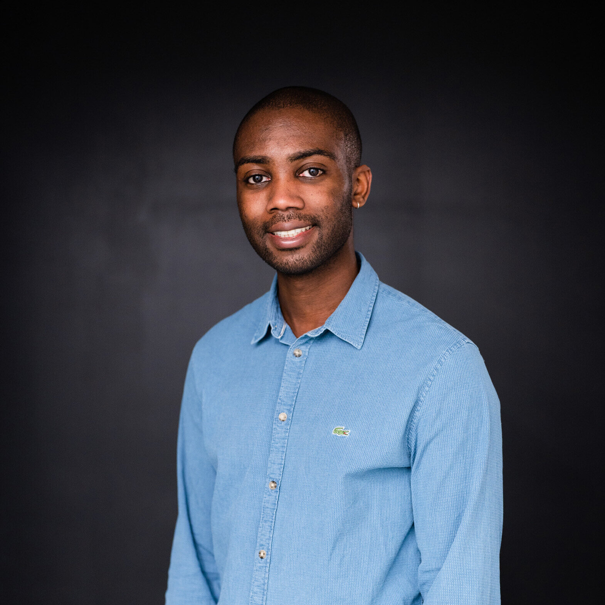
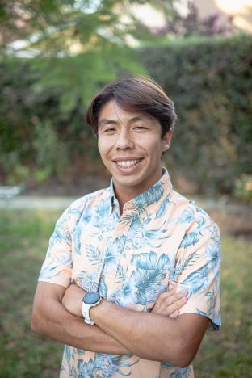
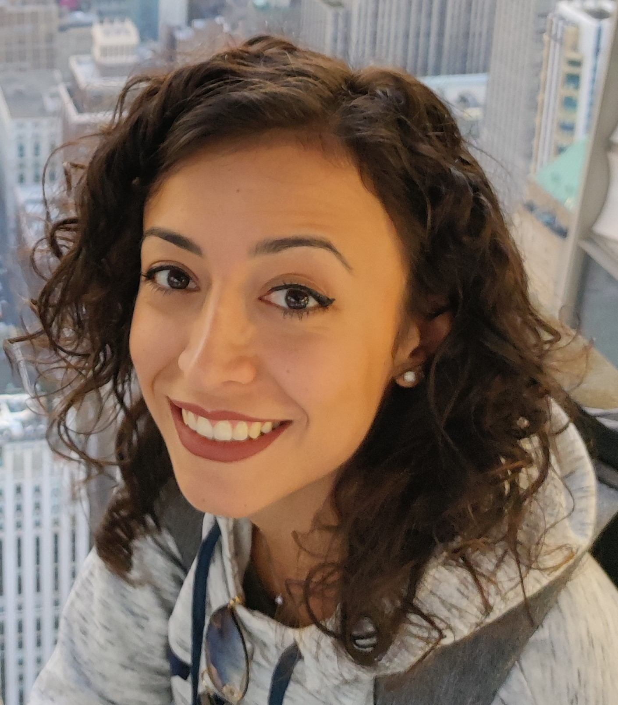

<!-- 

<h1 style="font-weight: bold;">About</h1>

 -->

# **About**

Deep Reinforcement Learning (DRL) has recently made remarkable progress in solving complex tasks in several application domains, such as games, finance, autonomous driving, and recommendation systems. However, the black-box nature of deep neural networks and the complex interaction among various factors, such as the environment, reward policy, and state representation, raise challenges in understanding and interpreting DRL models' decision-making processes. To address these issues, the workshop aims to explore the intersection of DRL with another important research area in artificial intelligence: Explainable Artificial Intelligence (XAI). XAI has become a crucial topic, aiming to enhance the accountability, trustworthiness, and accessibility of autonomous systems.

The workshop aims to bring together researchers, practitioners, and experts from both communities (DRL and XAI) by primarily focusing on methods, techniques, and frameworks that enhance the explainability and interpretability of DRL algorithms. Additionally, we will work towards defining standardized metrics and protocols to evaluate the performance and transparency of autonomous systems.

## **Topics**

The topics include <u>but are not limited to</u>:
- XAI methods for or applied to Deep Learning  (**even if it does not involve reinforcement learning**)
- Evaluation of XAI methods
- Self-Explainable Deep Reinforcement Learning
- Post-hoc methods for Deep Reinforcement Learning
- XAI-based Augmentation for Deep Reinforcement Learning
- Policies Interpretation
- Current-trend and Challenges in explaining Deep Reinforcement Learning
- Reinforcement Learning-based XAI methods
- Self-Explainable Deep Learning
- Interpreting Reinforcement Learning
- Debugging Deep Reinforcement Learning using XAI
- Applications of Deep Reinforcement Learning combined with XAI to real-world tasks 
- Position papers on the topic of the workshop.

Note: XAI methods applied to deep reinforcement learning models will be prefered for the selection of contribution do be presented during the workshop in case of bordline decisions. 

# **Schedule**
 TBD

# **Invited Speakers**

    
    
      
    

    

          

         <strong><a href="https://ai.sony/people/Jerone-Andrews/">Jerone Andrews</a></strong>
          
         <em>Sony AI</em>
          
         <em>TBD</em>
        

    

    
   
  
    

        

      

        <a href="https://eilab.gatech.edu/"><strong>Mark Riedl </strong></a> 
        <em>Georgia Institute of Technology</em>  
        <em>TBD</em>    
      

    

    
   
  
    

        

      

        <a href="https://koulanurag.dev/"><strong>Anurag Koul</strong></a> 
        <em>Microsoft Research</em>  
         
         <em>TBD</em>   
      

    

    
   
  
    

        

      

        <a href="https://www.linkedin.com/in/melinda-gervasio-b92147142"><strong>Melinda Gervasio</strong></a> 
        <em>SRI International</em>
         
         <em>TBD</em>     
      

    

# **Organization**
## **Organizers**

  

    

      <a href="http://robertocapobianco.com/">  
      
      

        <h3>Roberto&nbsp;&nbsp;Capobianco</h3>
        
Sony AI & Sapienza University

      

      </a>
    

  

  

    

    <a href="">
      
      

        <h3>Oliver Chang</h3>
        
University of California, Santa Cruz

      

    </a>
    

  

  

    

    <a href="https://people.ucsc.edu/~lgilpin/">
      
      

        <h3>Leilani H. Gilpin</h3>
        
University of California, Santa Cruz

      

    </a>
    

  

  

    

      <a href="https://biagiomattialarosa.github.io/">
      
      

        <h3>Biagio La Rosa</h3>
        
Sapienza University of Rome

      

      </a>
    

  

  

    

      <a href="https://sites.google.com/diag.uniroma1.it/michela-proietti">
      
      

        <h3>Michela Proietti</h3>
        
Sapienza University of Rome

      

      </a>
    

  

  

    

      <a href="https://alessio.ragno.info">
      
      

        <h3>Alessio Ragno</h3>
        
Sapienza University of Rome

      

      </a>
    

  

# **Call for Papers**

We solicit submissions of previously unpublished papers, both as **short** and **full** papers.
*Short papers* are up to 4 pages max without any supplemental material associated with.
*Full papers* are up to 7 pages and can be associated with supplementary materials (unlimited pages for supplemental material) attached at the end of the manuscript. Note that looking at supplementary material is at the discretion of the reviewers.
The references pages and the supplemental materials are not considered in the calculation of pages, so you can use unlimited references in both the cases. 

Submissions have to be novel contributions covering any topic listed below. We don't accept work that has been already accepted or published to other venues before the submission deadline, or that is presented at the main AAAI conference, including as part of an invited talk.

Papers must be submitted through the open review system (<a href="https://openreview.net/group?id=AAAI.org/2024/Workshop/XAI4DRL&referrer=%5BHomepage%5D(%2F)">LINK</a>)). 
This workshop is **not archival**. Therefore, <u> papers submitted to the workshop can be submitted to future conferences (e.g. ICML, IJCAI) if the acceptance notification comes after the workshop date (February, 27)</u>. 

*We encourage the authors to link a **anonymized** repository containing the code to replicate the results inside the corpus of the paper.* While this is not a mandatory requirement, it will be positively taken in account during the reviewing process and the selection of the contributed talks. You can use <a href="https://anonymous.4open.science/">Anonymous Github</a> or you can upload your repository on a service that allows anonymity (e.g. GDrive allows anonymous links).

Submissions must be in an **anonymized paper format** following the same template of the AAAI track (see <a href="https://aaai.org/aaai-conference/submission-instructions/"> HERE</a>). They will undergo double-blind peer review. Any data included in the submission (paper, supplemental material, linked code) must be anonymized. 

Accepted works will be presented as contributed talks or as posters depending on schedule constraints.
<u>It is mandatory that at least one of the authors will attend the workshop and present its work during the contributed talks and the poster session</u>. 

**Important Dates**

~~Submission system opens: Oct 15 11:59 PM GMT, 2023~~

~~Submission deadline: , ~~Nov 15~~ Nov 21st 11:59 PM GMT, 2023 (Extended!!!)~~

~~Notification date: Dec 10 11:59 PM GMT, 2023~~

Workshop: Feb 27 09:00 AM GMT-7, 2023 

~~Submission Link: <a href="https://openreview.net/group?id=AAAI.org/2024/Workshop/XAI4DRL&referrer=%5BHomepage%5D(%2F)">OpenReview</a>~~

# FAQ
- **Q: My work is a <u>model-agnostic XAI</u> method and one of the tests has been applied to deep learning but without considering reinforcement learning. Does it fit the workshop's topic?**  
*A: Yes, it does.*

- **Q: My work is a <u>XAI</u> method tailored for deep learning but without considering reinforcement learning. Does it fit the workshop's topic?**  
*A: Yes, it does.*

- **Q: My work is a <u>XAI</u> method tailored for a machine learning model different deep learning (e.g. decision tree). Does it fit the workshop's topic?**  
*A: We plan to allocate the first part of the workshop to an introduction to XAI methods. Therefore a limited number of slots could be allocated to this kind of work if needed (e.g. strong submissions from this set of works, low number of sumbission covering RL, etc.). We invite you to submit your work even if the method is applied to a different kind of machine learning model.*

- **Q: Will rejected papers be displayed on OpenReview?**  
*A: No they will not be displayed on OpenReview.*

- **Q: Will accepted papers be displayed on OpenReview?**  
*A: Yes, they will be displayed on OpenReview.*

- **Q: Will reviews be public after thre review stage?**  
*A: No, reviews will be visible only to Authors, Program Chairs, and reviewers.*

- **Q: Is the paper archived in any proceedings?**  
  *A: No, there will be no official proceedings. We will only host the papers on our website.*

- **Q: Can I attend the workshop without being registered for AAAI 2024 conference?**  
*A: The workshop is hosted by AAAI. Therefore, you have to be registered for the conference of AAAI 2024 in order to attend the talks and the poster session of our workshop.*

- **Q: Is there any additional cost associated with the acceptance of my paper?**  
*A: There are no additional costs associated with our workshop.*

## **Program Committee**
- Aaquib Tabrez, University of Colorado Boulder
- Alexander Binder, Singapore Institute of Technology
- Andrea Fanti, Sapienza University of Rome
- Andrew Silva, Georgia Institute of Technology
- Bettina Finzel, University of Bamberg 
- Chaofan Chen, University of Maine
- Daniel Hein, Siemens AG 
- David V. Pynadath, University of Southern California
- Di Wang, University of Illinois at Chicago
- Dmitry Gnatyshak, Barcelona Supercomputing Center 
- Erico Tjoa, Stanford University
- Eunji Kim, Seoul National University
- Francisco Cruz, University of New South Wales Sydney
- Fredrik Heintz, Linköping University
- George Vouros, University of Piraeus
- Giorgio Angelotti, ISAE-Supaero
- Ishan Durugkar, Sony AI
- James MacGlashan, Sony AI
- Jaesik Choi, KAIST
- Jasmina Gajcin, Trinity College Dublin
- Jasper van der Waa, Researcher at TNO
- José Antonio Oramas Mogrovejo, University of Antwerp
- Juan Marcelo Parra Ullauri,  University of Bristol
- Lindsay Sanneman, MIT
- Marco Valentino, Idiap Research Institute
- Moritz Lange, Ruhr University Bochum
- Nabil Aouf, City University of London
- Pradyumna Tambwekar, Georgia Institute of Technology
- Randy Goebel, University of Alberta
- Raphael C. Engelhardt, TH Koln
- Riccardo Guidotti, University of Pisa
- Sarra Alqahtani, Wake Forest University
- Satyapriya Krishna, Harvard University
- Shruti Mishra, Sony AI
- Suryabhan Singh Hada, University of California
- Tianpei Yang, Tianjin University
- Tobias Huber, Augsburg University
- Tom Bewley, University of Bristol
- Umang Bhatt, NYU’s Center for Data Science
- Wojciech Samek, TU Berlin
- Wolfgang Stammer, Technical University Darmstadt 
- Xiangyu Peng, Georgia Institute of Technology
- Xuan Chen, Purdue University
- Yotam Amitai, Technion Israel Institute of Technology
- Ziheng Chen, Stony Brook University

# **Contacts**
If you have any questions feel free to contact us at any of the following email addresses:
- ragno AT diag.uniroma1.it
- mproietti AT diag.uniroma1.it
- elochang AT ucsc.edu

